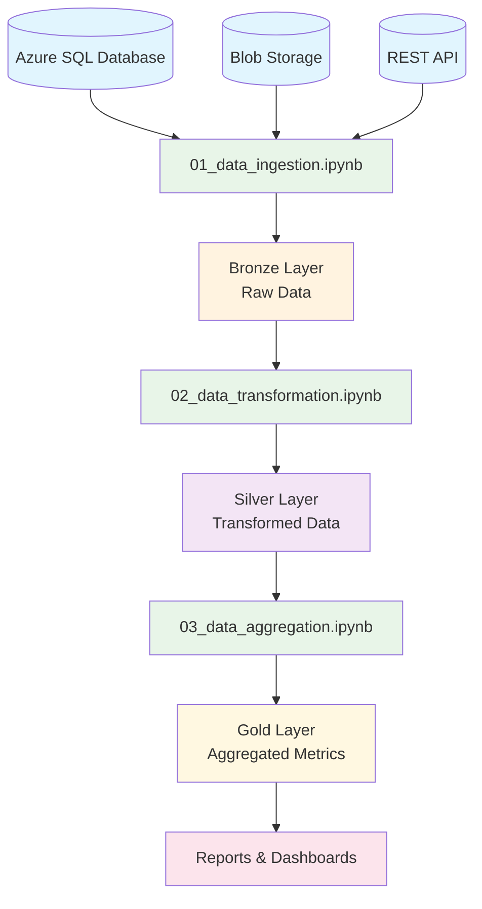
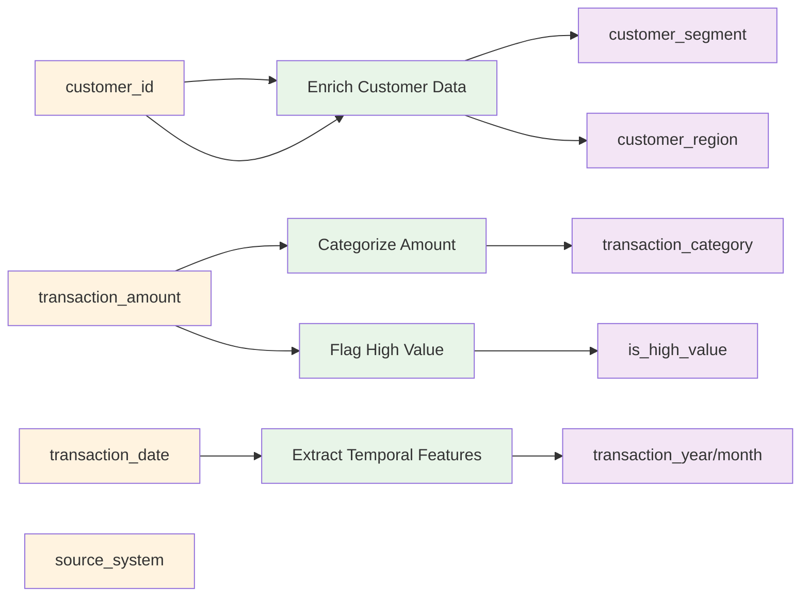
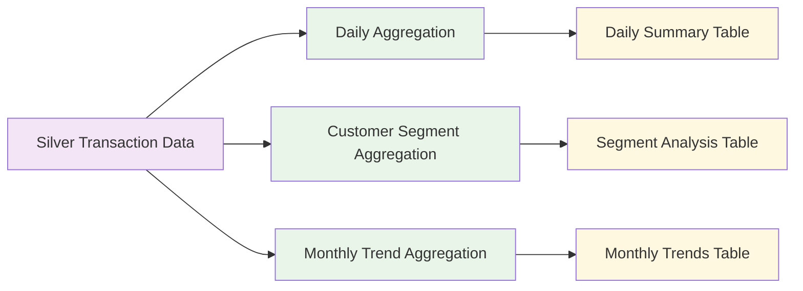
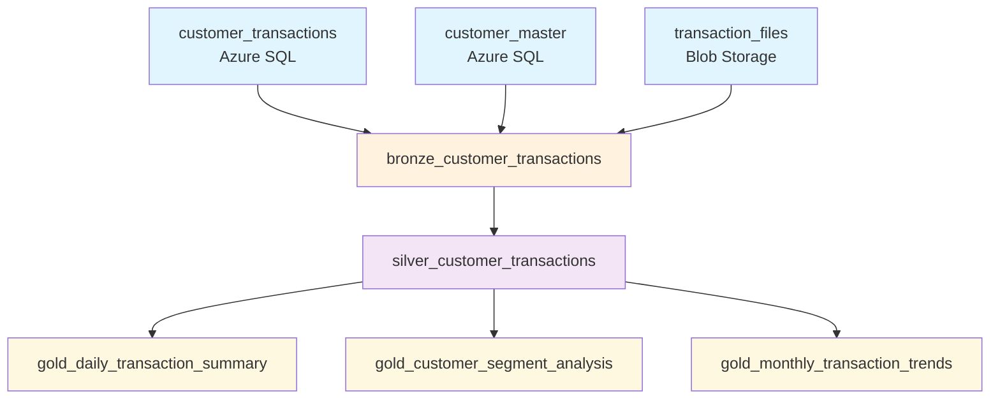

# Data Lineage and Flow Visualization

## Pipeline Data Flow

## Detailed Data Transformations

### Bronze → Silver Transformations

### Silver → Gold Aggregations

## Execution Timeline

```mermaid
gantt
    title MS Fabric Pipeline Daily Execution Schedule
    dateFormat HH:mm
    axisFormat %H:%M
    
    section Data Ingestion
    01_data_ingestion.ipynb    :active, ingestion, 02:00, 60m
    
    section Data Transformation  
    02_data_transformation.ipynb :transformation, after ingestion, 90m
    
    section Data Aggregation
    03_data_aggregation.ipynb   :aggregation, after transformation, 45m
    
    section Quality Checks
    Data Validation            :validation, after aggregation, 15m
```

## Table Dependencies

